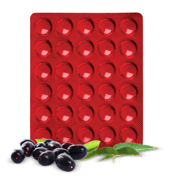

# Tribangshila

[TOC]

Improves quality of life in type 2 diabetes. Indication: Diabetes mellitus (type II) and its complications.

## Composition
Composition: Each tablet contains- Nimb patra (Melia azadirachta) 80 mg Gudmar(Gymnema sylvestre) 80 mg Jamubul Ext.(Eugenia jambolana) 40 mg Mamejawa Ext.(Enicosterna littorale) 40 mg Shilajit 40 mg Yashad Bhasma 20 mg Bang Bhasma 10 mg.

## Dosage
2 to 4 tablets twice a day before meals.

* Normalizes release of insulin in diabetic patients. Rejuvenates Beta cells to produce insulin. No toxic manifestations. No hypoglycemic reaction.
