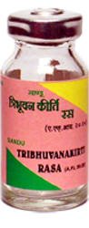

# Tribhuvan Kirti

[TOC]

1. Useful in all types of fever
1. Has antipyretic and analgesic action.
1. It is useful in Influenza, Bronchitis, Tonsillitis, Chicken pox & Measles

## Indications
1. Fever with chills
1. Tonsillitis
1. Common cold
1. Bronchitis
1. Chicken pox & Measles.

## Dose
1 tab 3-4 times

## Ingredients
Cinnabar (Hingul) Aconitum ferox, Trikatu, Borax, root of Piper longum.
Datura metel, Zingiber officinale, Ocimum sanctum
