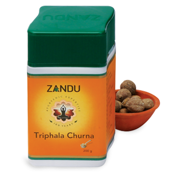

# Triphala Churna

[TOC]

The recipe for this traditional herbal supplement dates back thousands of years and is referenced in the traditional Indian texts the Charak and Sushrut Samhitas. A 'Tridoshic rasayan', having balancing and rejuvenating effects on the three constitutional elements that govern human life.

## Composition
Whole powdered fruits: Haritaki (Chebulic Myrobalan) , Bibhitaki (Beleric myrobalan), Amalaki (Emblic myrobalan).

## Dosage
Half to 1 Tea spoonful (3-6g). Twice a day with luke warm water / milk. Soak in water for overnight to wash eyes and / or for mild laxation.

* Natural anti-oxidant, to assist natural internal cleansing Detoxifies and rejuvenates body Nourishes & rejuvenates the tissues Supports the proper functions of the digestive, circulatory, respiratory & genitourinary systems. Supports healthy digestion & absorption, gently maintains regularity. Effective in eye disorders and constipation.
