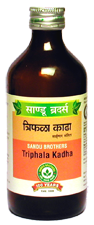

# Triphala Kadha

[TOC]

**Useful in Infective Hepatitis**
It has hepatoprotective and cholagogue action. It protects liver cells from harmful effects of viruses. By its cholagogue action, it stimulates secretion of bile from liver into the small intestine. By its laxative action it eliminates vitiated Pittadosha and toxins out of body It relieves constipation as well as improves digestion. It helps to regenerate liver cells.

## Indications
1. Jaundice
1. Hepatitis
1. Constipation
1. Anaemia.

## Dose
4 tsf 2 times.

## Ingredients
1. Terminalia chebula,
1. Terminalia bellerica,
1. Embelica officinalis,
1. Andrographis panniculata,
1. Picrorrhiza kurroa,
1. Tinospora cordifolia,
1. Adhatoada vasica, Azadirachta indica
