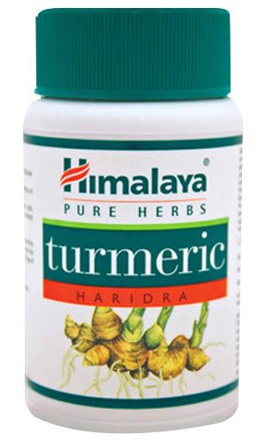

# Turmeric

[TOC]

It is antiallergic, anti-inflammatory and antimicrobial properties are helpful in alleviating skin allergies and other skin problems.

## Indications:
Skin infections, cholesterol.

## Use Directions:
Take 1 or 2 capsules twice daily with meals.
