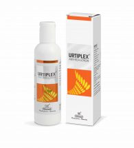

# Urtiplex Anti-itch Lotion

URTIPLEX ANTI-ITCH LOTION is a natural antiallergic and anti-itch formulation. Kumari gel (Aloe Vera) is very potent herb known for its skin soothing, antiinflammatory as well as antibacterial activity. Marigold oil (Tagetes erecta) and Sarson oil (Brassica campestris) possess antiinflammatory and antioxidant activity which helps in relieving itching and reducing the flare-ups. Menthol is beneficial for urticaria due to its cooling effect and antipruritic potentials. Zinc oxide and Kokum (Garcinia indica) butter help to soothe skin rash and hives.
