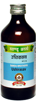

# Ushirasava

[TOC]

**Cooling, haemostatic and pitta pacifying**

It is diuretic, cooling, tranquilizer and blood purifier. It is useful in all types of bleeding disorders, e.g. epistaxis, bleeding per rectum, menorrhagia etc.

## Indications
Bleeding disorders
UTI
Urolithiasis
Bleeding Piles
Diabetes
Menorrhagia

## Dose
4 tsf 2 times

## Ingredients
Vetiveria zizanioidis, Nelumbo nucifera, Gmelina arborea, callicarpa macrophylla, symplocos racemosa, Rubia cordifolia etc.
It is also useful in dyswia, oligwia & burning micturition.
It is useful in urolithiasis.
