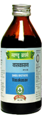

# Vasakasav

[TOC]

**Chronic cough, Chronic disorders of Respiratory tract**

The main active ingredient is Adhatoda vasica. It has mucolytic, expectorant and broncho-dilator action. It helps to liquefy and bring out the sputum. It is useful in acute well as chronic cough. It checks bleeding therefore useful in bleeding disorders.

## Indications
1. Cough
1. Tuberculosis
1. Bronchial Asthma
1. Generalised oedema and Bleeding disorders.

## Dose
4 teaspoonful 2 times

## Ingredients
1. Adhatoda vasica
1. Woodfordia fruticosa
1. Cinnamomum zeylanicum
1. Eletteria cardamomum
1. Cinnamomum tamala
1. Mesua ferra
1. PiperCubeba
1. Trikatu etc.
