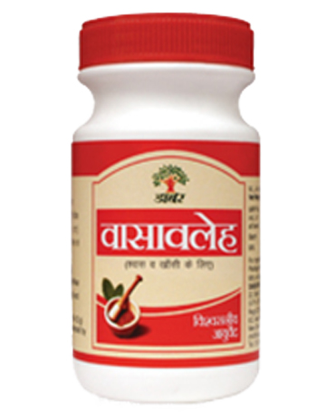

# Vasavaleha

**Dabur Vasavaleha** is a concoction of essential Ayurvedic herbs that have bronchodilatory and antimicrobial properties. It is used in the treatment of cough, asthma, bronchitis, pain abdomen, bleeding disorders and fever.

## Why Dabur Vasavaleha?
* Herbal preparation
* Treats respiratory & bleeding disorders
* Useful in treating tuberculosis
* Can be safely administered to people of all ages
* No side effects
