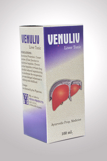

# Venus Liver Tonic

[TOC]

* **Venuliv** (Herbal Liver Tonic) - Herbal Liver Tonic is used to treat various liver related diseases.

## COMPOSITION :-  ( EACH  5 ML CONTAINS  EXT. OF)
* PILHARI - 3.50 MG
* NAGAR - 2.50 MG
* VARIDA - 5.00 MG
* PUNARNAVA - 7.50 MG
* VIDANGA - 7.50 MG
* ATIVISHA - 2.50 MG
* CHAKRANGI - 1.25 MG
* DIPIKA - 2.50 MG
* GRANTHIMUL - 5.00 MG
* VAKRA - 2.50 MG
* SHOBHANJAN - 7.50 MG
* ROHITAK - 2.50 MG
* COLOURED AMRANTH & SUGAR BASE - Q.S.

## External Links
* [Venus Products](http://www.venusherbalproducts.com/herbal-liver-tonic-2009854.html)
