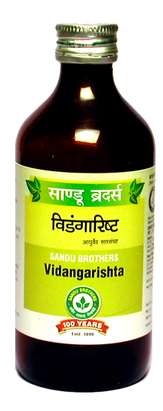

# Vidangarishta

[TOC]

**Vidangarishta** eradicates worms and prevents their recurrence. Regular use of Sandu Vidangarishta provides desired strength to intestine to prevent relapse of worm infestation. It helps to improve appetite and digestion.

## Indications
1. Worm infestation
1. Calculus
1. Diabetes
1. Enlargement of Prostate

## Dose
4 teaspoonful 2 times.

## Ingredients
1. Embeliua ribes
1. Piper longum
1. Vanda roxburghi
1. Holarrhena antidysenterica
1. Cissampelos pareira
1. Aloe vera
1. Embelica officinalis
1. Honey
1. Woodfordia fruticosa
1. Cinnamomum  zeylanicum
1. Elettaria cardamomum
1. Cinnamomum tamala
1. Agalaia roxburghiana
1. Piper nigrum
1. Piper longum
