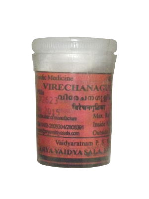

# Virechana Gulika

Virechana Gulika  is a herbal; formulation in tablet form.

Its usage:  It helps to relieve constipation. It is used in Virechana panchakarma therapy.

Dosage: The dose of this tablet is based on the expertise and judgement by the doctor.

## Virechana Gutika ingredients
1 part each of
* Trikatu – pepper, long pepper and ginger
* Triphala
* Mamsi – Nardostachys jatamansi
* Jatamamsi – Nardostachys jatamansi
* Karavi – Black Cumin – Nigella sativa
* Katuki – Picrorhiza kurroa
* Trivrit – Operculina turpethum
* Vidanga – False black pepper – Embelia ribes
* Jaipala beeja – seed of Croton tiglium – 1/16th part of the above total.
* The powder of above herbs is pounded with Triphala kashaya and pills are prepared.
* The pills are administered along with jaggery, lukewarm water or fresh ginger juice extract.
