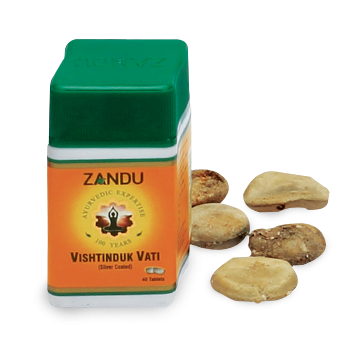

# Vishtinduk Vati

[TOC]

Vishtinduk Vati is prepared from purified Vishtinduk (Strichnus Nux-vomica). It is one of the most potent medicines for nerve disorders. It's an excellent nerve tonic which can cure neurotic pains, intestinal colic, Lumbago and local paralysis and other neurotic affections.

## Composition
Karaskar (Strichnus Nux-vomica).

## Dosage
1 tablet two times daily with milk or water.

* Useful in Dyspepsia, Diarrhoea, Intestinal Colic, Lumbago and local Paralysis and Neurotic affections. Mostly used in General and Sexual Debility Useful in Jaundice, Hepatitis, Congestion of the Liver, Anaemia, Enlargement of the Spleen, Dysepsia and Dropsy.
