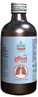

# Whoopin

[TOC]

Relieves distressing cough

It is useful in all types of cough. It reduces inflammation of bronchus. It liquefies sputum with mucoytic action and brings it out with expectorant action. It reduces throat irritation by demulcent action.

## Indications
1. Distressing cough
1. Asthma
1. Cold
1. Hoarseness of voice

## Dose
Infants - 20 drops 2 times
Children - 1/2 to 1 teaspoonful 2 times)
Adults - 2 tsf 2 times

## Ingredients
Vitis vinifera, Ficus carica, Glycyrrhiza glabra, Mimosa pudica, Adhatoda vasica, Solanum xanthocarpum etc.
