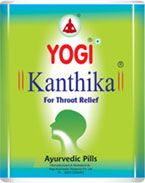

# Yogi Kanthika

It is specialy formulated for throat related disorders. It is available in 15 pills, 70 pills and 140 pills packing. It contains 13 ayurvedic ingredients which have specific benefits to human.

## Key Ingredients
Each Chewable Pill Contains

* Mulethi : 42%
* Sunth 10%
* Jaiphal : 4.75 %
* Tulasi :2.5%
* Sheetalchini : 2.5%
* Pudina tel: 2.0%
* Lavang tel: 2.0%
* Kapoor : 2.0%
* Ajwain ka satva : 0.25 %
* Mulethi Satva : 30%
* Babool Ki goond : q.s.
