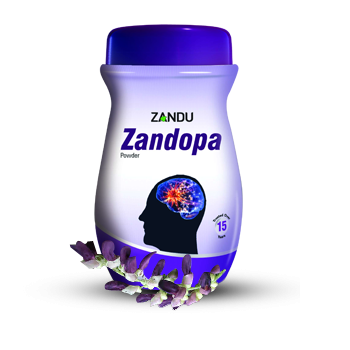

# Zandopa

[TOC]

Life is beautiful again. Indication: Idiopathic Parkinsonism. Special instructions: PRECAUTIONS: All known precautions and contraindications as applicable to synthetic L-dopa formulation should also be followed while prescribing Zandopa. Monoamine oxidase inhibitors, if taken by patients, must be discontinued atleast 2 weeks prior to institution of Zandopa therapy. As with levodopa,periodic evaluations of hepatic, haematopoietic, cardiovascular and renal functions are recommended during extended therapy with zandopa Zandopa should be administered with caution in severe cardiovascular or pulmonary disease, bronchial asthma, renal, hepatic, or endocrine disease and in presence of peptic ulcer or chronic narrow angle glaucoma. SIDE EFFECTS: Side effects include nausea, anorexia, cardiac irregularities, orthostatic hypotension, weight gain, hot flushes, numerous dyskinesias and psychiatric symptoms such as agitations, hallucinations, delusions and nightmares. Side effects as encountered with synthetic L-dopa formulations have not been seen to the same severity with Zandopa.

## Composition
Each 7.5gm contains - Standardized processed seed powder of Kauncha (Mucuna pruriens) 6.525 gm in a flavored base.

## Dosage
* NOT TO BE TAKEN WITH MILK.In a half glass of water (approx.100ml) suspend prescribed dose of powder, stir and drink immediately. A measure of 7.5gm (approx.) is provided in the container L-dopa content of Zandopa powder is readily soluble in water. Patients finding difficulty in swallowing of the bulk may be advised to stir the powder in water for nearly one minute and strain. Clear solution thus obtained may be consumed by the patient.

* Ayurvedic formulation derived from the seeds of Mucuna pruriens. Long history of use in Ayurvedic practice for CNS disorders and also as a geriatric tonic. Natural and richest known source of L-dopa. More readily bioavailable than synthetic L-dopa.
