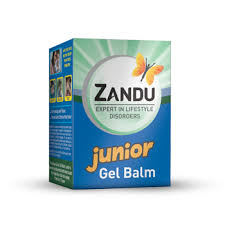

# Zandu Gel Balm Junior

[TOC]

In today's competitive world, kids' life is not really as colorful as it was earlier. With the pressure from parents to excel in all the fields, today's little champs are getting stressed out. Poor eating habits and exposure to technology (mobile phones, computer, i-pads) has added to the stress levels. Kids therefore suffer from stress, cold, aches and pains in a day to day life. However, there is really no 'pain solution' that's child friendly.
To address this need gap, we have launched Zandu Gel Balm junior, India's first mild gel balm for children. It is clinically proven to give fast and long lasting relief on kids' cold, headache and body ache in a child friendly and natural way.

## Composition
Mentha sp ----, Satva 6%, Gaultheria fragrantissima - OL. 1%, Cinnamomum camphora - Satva 11%, Syzygium aromaticum --- OL. 0.3%, Trachyspermum ammi --- Satva 0.1%, Eucalyptus globulus - OL. 2%, Myristica fragrans - OL. 0.5%, Origanum majorana - OL. 0.5%, Quinazarine Green SS, Base q.s.

## Usage
Apply on affected parts and gently massage.
It provides fast & long lasting relief from: kids' cold, headache and body ache in a child friendly and natural way.

* India's first and only gel based balm for Kids
1. Clinically proven
1. Pleasant aroma/ fragrance which gives relaxing feeling and relieves stress.
1. Dermatologically tested & hence safe to be applied on kid's skin above 4 years of age
1. Powerful ayurvedic herbs
1. Convenient and easy to apply
