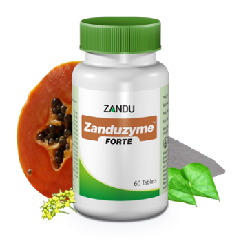

# Zanduzyme Forte

[TOC]

Zandu introduces extract based Forte Range of products in attractive HDPE container; herbs in extract form (100% soluble fraction) ensures better bioavailability; confirms the superiority & potency of Forte formulation with just 1 tab BD dosage. Its indication are as follows: APD, Acute Indigestion and Dyspepsia. Bring ease after heavy food intake.

## Composition
Papaya (Carica papaya)-45 mg, Sunthi (Zingiber officinale)-37.2 mg, Shankh Bhasma-30 mg, Yavani (Ptychotis ajowan)-30 mg, Hingu (Ferula foetida)-25 mg, Maricha (Piper nigrum)-18.6 mg, Chitrak (Plumbago zeylanica) extract-15 mg, Pippalimool (Piper nigrum) extract-15 mg, Dantimool (Baliospermum montanum)15 mg, Chincha bhasma-15 mg, Guduchi (Tinospora cordifolia) extract -12 mg, Yavakshar- 10 mg, Sarjikshar -10 mg,

## Dosage
1 tablet twice daily or as directed by the physician.

* Extract based formula ensures better efficacy, potency & better disease control.
Better patient compliance with just 1 tab BD dosage compare to 2 tablet BD or TID conventional dosage.
Derived from natural source, no side effects or adverse effects reported.
