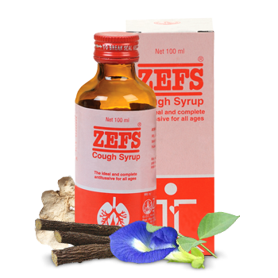

# Zefs

[TOC]

The natural cough reliever. Indication: All types of productive and non-productive cough of varied etiology. Inflammatory catarrhal conditions of respiratory tract. Smoker's cough, laryngitis, bronchitis, bronchial asthma and tropical eosinophilia.

## Composition
Each 5ml contains- Aqueous extract derived from: Vasaka(Adhatoda vasica) 200 mg Kantakari (Solanum xanthocarpum) 200 mg Chavak(Piper chaba) 10 mg Karkatshrungi(Pistacia integerrima) 10 mg Dhamasa(Fagonia arabica) 10 mg Bharangmoola(Clerodendron serratum) 10 mg Rasna(Pluchea lanceolata) 10 mg Kachura(Curcuma zedoaria) 10 mg Chitrakmoola(Plumbago zeylanica) 10 mg Musta (Cyperus rotundus) 10 mg Sunthi(Zingiber officinale) 10 mg Maricha(Piper nigrum) 10 mg Pippali (Piper longum) 10 mg Yashtimadhu(Glycyrrhiza glabra).

## Dosage
Adults: 1-2 teaspoonful twice or thrice a day. Infants and children: 1/2 - 1 teaspoonful twice or thrice a day.

* Provides quick and effective relief from nagging cough. Effective herbal preparation that soothes mucosal irritation and facilitates easy expectoration. Mucolytic, expectorant, decongestant and broncho-dilatory effect. Reduces inflammation of respiratory passage. Contains Adhatoda vasica, a natural source of Bromhexine which is a proven mucolytic agent. Free from alcohol and narcotic derivatives,avoids drowsiness and keeps patients alert and active. Safe for adults, children as well as infants.
