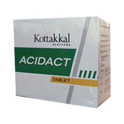

# Acidact Tablet

[TOC]

It helps to regulate the acid secretions and reduces abdominal discomfort and [Cholic acid](../../physiology/Cholic_acid.md). This helps in digestion and also gives relief in peptic ulcers by its analgesic and anti inflammatory properties.

## Each Acidact Tablet is prepared out of
* Pushkaramula (Inula racemosa) - 1.0g
* Erandamula (Ricinus communis) - 1.0g
* Yavam (Hordeum vulgare) - 1.0g
* Dhanwayashamula (Tragia involucrata) - 1.0g
* Excipients q.s

## References
* [Kottakkal](https://www.eayur.com/ayurvedic/vati-tablets/kottakkal-acidact-tablets.htm)
