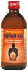

# Ajwain ark

[TOC]

## Active Ingredients
Carum Ajmoda([Celery](Celery.md) Seed)

## Therapeutic Use
Carminative And Antipasmodic.Useful In Colic, Flatulence, Dyspepsia,

## Dose
30ml to 60ml used as anupan or as directed by physician.
