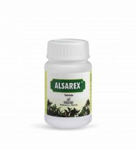

# Alsarex Tablet

**ALSAREX** is preferred herbal combination for the management of uncomplicated gastric and duodenal ulcer. ALSAREX is a natural antacid. ALSAREX not only reduces the acid secretion but also strengthens the mucosal defense. [Amalaki](Amalaki.md) (Emblica officinalis) reduces the hypersecretion of stomach acid. [Satavari](Satavari.md) (Asparagus racemosus) increases mucosal defensive factors. [Yashtimadhu](Yashtimadhu.md) (Glycyrrhiza glabra) in ALSAREX has anti-H.pylori activity. H.pylori bacteria are considered to be a common cause of digestive illnesses like gastritis and peptic ulcers. Usheer (Andropogan muricatus) is antispasmodic and Oudumbar (Ficus glomerata) is gastroprotective. Thus, ALSAREX is a single comprehensive remedy for acid peptic disorders.
