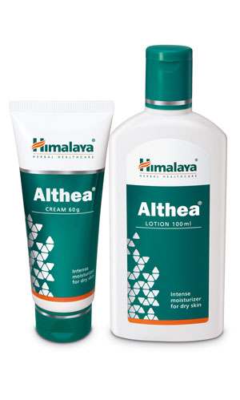

# Althea

**Althea** is a topical formulation recommended for the management of xerosis (abnormal dryness of skin).

Althea moisturizes and soothes dry, inflamed, and itchy skin. Althea replenishes critical skin lipids, restores skin hydration and supports the integrity of the natural skin barrier. It improves the appearance of the skin and promotes softer, healthier-looking skin.

Althea is non-sticky, non-staining and free from mineral oils, parabens, fragrances and artificial colors.

## Key Ingredients
**Rice** (Oryza sativa) The unique, naturally occurring ceramides in rice bran help replenish skin lipids, significantly increase water content in the stratum corneum (the outermost layer of the skin), significantly reduce transepidermal water loss, and restore effective skin barrier function.

[Vrikshamia](Vrikshamia.md) (Kokum) (Garcinia indica) has an emollient effect and fills up spaces between skin flakes, reduces transepidermal water loss and enhances epidermal barrier function, thus helping to maintain skin hydration and integrity.

[Coconut](Coconut.md) (Cocos nucifera) inhibits the inflammatory response and helps modulate the skin's immune response.

[Kumari](Kumari.md) (Aloe vera) acts as a humectant by facilitating the transfer of moisture to the skin, and thus improves skin hydration.
