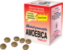

# Amoebica tablets

[TOC]

## Importance
Amoebica tablet is [Ayurvedic medicine](../../concepts/Ayurvedic_medicine.md) formulation effective in Amoebiosis, Diarrhoea, Constipation, Haemorrhagic dysentery. it provides long lasting relief.

## Dosage
1-2 Tab 2-3 times in a day or as directed by physician.

## Indications
1. Amoebiosis
1. Diarrhoea
1. Dysentery
1. Haemorrhagic Dysentery
1. Abdominal Colic
1. Constipation

## References
* [Baidyanath](http://www.baidyanath.org/ViewProduct/amoebica-tablets)
