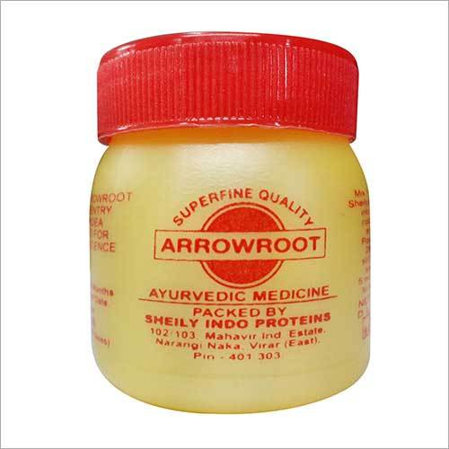

# Arrowroot Powder

* **Herbal Arrowroot Medicine** - Arrowroot [Herbal Medicine](../../medicines/Herbal_Medicine.md) helps to preventing and controlling diarrhea and soothe irritable bowel syndrome.

* **Arroowroot Powder** - Arrowroot Powder is used as a nutritious and easily digested food starch for infants and elderly patients.

## External Links
* [Sheily Indo Proteins](http://www.sheilyindoproteins.com/Exporters_Suppliers/Exporters/hp/scripts/prod_search.html?keyword=Arrowroot+Powder&catalog_id=61226&submit.x=0&submit.y=0)
