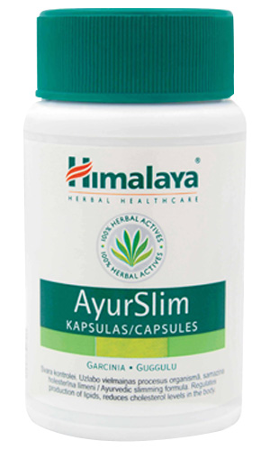

# AyurSlim

[TOC]

**Ayurslim** claims to bring about efficient burning of fat.Inhibits fatty acid synthesis, thereby reducing fat accumulation in the body. The product claims to reduce cholesterol levels in the body, factors that are concerned with fat accumulation. The product furhter claims to reduce the craving for food and sweets, thereby reducing the intake of fats and carbohydrates. It is said to bring about effective utilization of glucose in the body, which has a role to play in fat accumulation in the body. The product claims to lead to optimal utilization of nutrients and energy, thereby correcting energy imbalances in the body that are responsible for fat accumulation.

## Ingredients Include:
1. Vrikshamla (*[Garcinia cambogia](../../herbs/Garcinia_cambogia.md)*) which limits the synthesis of fatty acids in the muscles and liver and thus limits production of lipids.
1. [Guggul](../../medicines/Guggul.md)u (*[Commiphora wightii](Commiphora_wightii.md)*) which reduces cholesterol and triglyceride levels.
1. Meshashringi (*[Gymnema sylvestre](Gymnema_sylvestre.md)*) which helps reduce the craving for sugar and sweets and neutralises the excess sugar present in the body, thus preventing it from turning into fat.
1. [Haritaki](Haritaki.md) (*[Terminalia chebula](Terminalia_chebula.md)*) which has potent cholesterol-lowering properties.
1. Medhika (*[Trigonella foenum-graecum](Trigonella_foenum-graecum.md)*) which helps reduce blood glucose levels.

## Use Directions:
* 2 capsules twice a day after breakfast and dinner, for a minimum period of 3 to 6 months.
