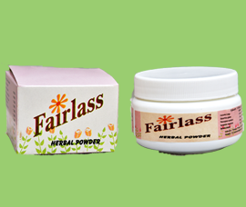

# Ayurvedantha Face Pack

**Fairlass - Face Pack** - It is used to remove pimples, keeping face clear, eradicating  prurigo, treating skin blemishes and coarseness of skin etc. We formulate it using [Haridra](Haridra.md) (Curcuma longa), Glycyrrhiza glabra,  Symplocos racemosus, Berberis aristata, Ficus benghalensis,  Kaolinum, Santalum album, Coccus lacca extract.

## External Links
* [Ayurvedantha](http://ayurvedantha.tradeindia.com/herbal-face-pack-3273099.html)
