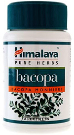

# Bacopa

[TOC]

**Benefits of Bacopa / Brahmi**: Healthy mind, memory, mental alertness, reduces anxiety, restlessness, helps during age related senility

Bacopa is a pure herb extract. Bacopa or [Brahmi](Brahmi.md) (Latin name: Bacopa Monnieri) is a classic brain and nervine tonic.

Bacopa supports healthy brain functions like mental clarity, consciousness, attention span. It invigorates the mind and also relaxes it.

Bacopa is considered the main rejuvenating herb for nerve and brain cells and, therefore, has played a very important role in Ayurvedic therapies for age related cognitive issues.

According to Alternative Medicine Review (March 2004), "Recent research has focused primarily on Bacopa's cognitive effects, specifically memory, learning, and concentration, and results support the traditional Ayurvedic claims."

Various studies have shown that Bacopa / Brahmi supports protein activity and protein synthesis, especially in brain cells, which promote intelligence, longevity and memory and help reduce age related senility. Bacopa also helps to relax the mind and helps to calm restlessness in children. Bacopa is also helpful for rejuvenating the mind from the stresses and exhaustion of daily life.

## Benefits of Bacopa / Brahmi
1. Bacopa supports the mind, intellect, and mental acuity.
1. Bacopa supports the physiological processes involved in relaxation.
1. Bacopa improves memory, mental clarity and longevity.
1. Bacopa has been used historically as a potent nerve tonic.
1. Recent research on Bacopa confirms its cognitive effects, specifically memory, learning, and concentration.
1. Bacopa reduces anxiety and restlessness.
1. Bacopa helps to reduce age related senility.

## Directions for taking Himalaya Bacopa
1 or 2 capsules twice daily with meals. Allow several weeks for long lasting benefits. The use of natural products provides progressive but long-lasting results.

## Bacopa in Ayurveda:
**Bacopa** has been used in the Indian medical system of Ayurveda since the 6th century A.D. to help improve mental performance. Bacopa is the classic Ayurvedic nervine and brain tonic. Bacopa is included in a class of Ayurvedic herbs called "Brahmi",in honor of Brahma, the creator, in the trinity with Vishnu, the preserver, and Shiva, the destroyer. Literally translated this mean "Godlike". Obviously, Bacopa is held in great esteem in the science of Ayurveda to earn this title, and rightfully so due to its multitudinous effects on the body and mind.

Brahmi has been known to be a pacifier of all three doshas, mainly kapha and vata. Ayurvedic physicians believe it to be ideal for counteracting the vitiated vata dosha, the factor which governs the nervous system. Ayurvedic tests describe Brahmi as medhya, a herb that braces the mind to carry cognitive functions and intellectual pursuits. But ancient authors seem to believe that the healing effects of Brahmi extend far beyond mind and brain. Brahmi is not only a memory-booster and intellect-promoting herb; it is also a relaxing and digestive agent.
