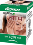

# Balm

[TOC]

## Importance
Baidyanath balm is a [Ayurvedic medicine](../../concepts/Ayurvedic_medicine.md) effective in headache, body ache, and cold. It is trusted home remedy for pain relief and comfort.

## Dosage
Apply on forehead gently.

## Indications
1. Analgesic
1. Headache
1. Cold
1. Deodorant
1. Decongestant
1. Stimulant
