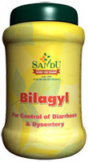

# Bilagyl

[TOC]

**Controls diarrhoea and dysentery, Strengthens G.I. tract**

It is indicated in bacillary and amoebic dysentery. It relieves diarrhoea and dysentery without causing Constipation. Bilagyl helps to heal the ulcers in the gastrointestinal tract. It alleviates abdominal pain. It also has anthelmintic action. It is indicated in Enteric Fever.

## Indications
Diarrhoea, Dysentery, Bloody Diarrhoea, Irritable Bowel Syndrome.

## Dose
2 tsf 2 times a day.Each teaspoonful of Bilagyl contains 2.3 gm of Bael fruit.

## Ingredients
[Shreephala](Shreephala.md) (Aegle marmelos), Sugar
