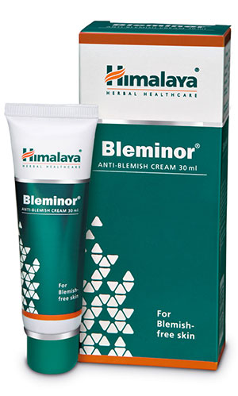

# Bleminor

Melasma is a type of discoloration that appears on the face and hyperpigmentation is a skin condition caused by oxidative damage. Bleminor inhibits melanin synthesis and has antioxidant activity.

Bleminor’s anti-inflammatory property is beneficial in preventing hyperpigmentation due to recurrent inflammation. It also aids in correcting skin discoloration resulting from injury.

## Key ingredients
**Licorice** [Yashtimadhu](Yashtimadhu.md) inhibits tyrosinase activity (catalyzes the production of melanin) in the melanin-producing cells without causing cell toxicity. It possesses anti-inflammatory properties, which are helpful in controlling hyperpigmentation due to recurrent inflammation.

**Indian Copal Tree** (Sarja) is a rich source of natural antioxidants that helps in decreasing melanin synthesis. It is also known to inhibit melanogenesis (production of melanin).

**Silk Cotton Tree** (Shalmali) has excellent tyrosinase-inhibitory and antioxidant properties that inhibit melanin production.

**Almond** (Vatada) smoothes and rejuvenates the skin and improves skin complexion and tone.
