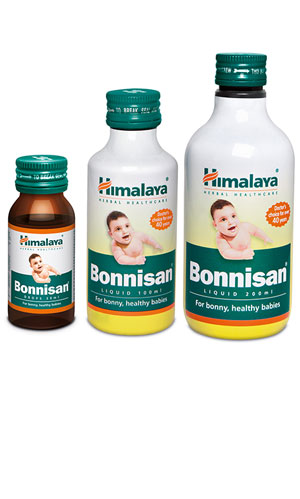

# Bonnisan

[TOC]

Common GI disorders in infants and children, including infantile colic, diarrhea, abdominal pain and dyspepsia. **Bonnisan** relieves smooth muscle spasms associated with colic, protects the GI mucosa, expels gas from the GI tract and combats acute and chronic infections.

Ensures overall health: Bonnisan helps restore the normal physiological functions of the digestive tract which maintains overall health and well-being in infants and children.

## Key ingredients
**Dill Oil** [Shatapushpa](Shatapushpa.md) has potent carminative, stomachic, antimicrobial and mucoprotective (protects the mucus membrane of the GI tract) properties, which significantly decrease flatulence, abdominal colic and distension and also improve appetite.

**Tinospora Gulancha** [Guduchi](Guduchi.md) is an anthelmintic, which dispels parasitic worms from the intestine. The herb also improves digestion and has hepatoprotective properties.

**Indian Gooseberry** [Amalaki](Amalaki.md) has strong mucoprotective, antispasmodic and antisecretory properties that improve the functionality of the gastrointestinal tract. This results in the reduction of abdominal colic and discomfort. Indian Gooseberry is also a potent antioxidant with free radical scavenging properties.

## Directions for use
Please consult your physician or pediatrician to prescribe the dosage that is best suits your infant or child.
