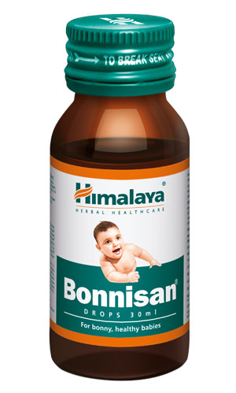

# Bonnison Drops

[TOC]

## Action
Combats gastrointestinal (GI) disorders: Common GI disorders in infants and children, including infantile colic, diarrhea, abdominal pain and dyspepsia. Bonnisan relieves smooth muscle spasms associated with colic, protects the GI mucosa, expels gas from the GI tract and combats acute and chronic infections.

Ensures overall health: Bonnisan helps restore the normal physiological functions of the digestive tract which maintains overall health and well-being in infants and children.

## Indications
* For the treatment of common digestive complaints in infants and children
* As a daily health supplement for infants and children to promote healthy growth

## Key ingredients:
Ayurveda texts and modern research back the following facts:

Dill Oil (Shatapushpa) has potent carminative, stomachic, antimicrobial and mucoprotective (protects the mucus membrane of the GI tract) properties, which significantly decrease flatulence, abdominal colic and distension and also improve appetite.

Tinospora Gulancha (Guduchi) is an anthelmintic, which dispels parasitic worms from the intestine. The herb also improves digestion and has hepatoprotective properties.

Indian Gooseberry (Amalaki) has strong mucoprotective, antispasmodic and antisecretory properties that improve the functionality of the gastrointestinal tract. This results in the reduction of abdominal colic and discomfort. Indian Gooseberry is also a potent antioxidant with free radical scavenging properties.

## Directions for use
* Please consult your physician or pediatrician to prescribe the dosage that is best suits your infant or child.

## Side effects
* Bonnisan is not known to have any side effects if taken as per the prescribed dosage.

## References

## References

1. Products of the Himalaya Drug Company
