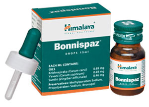

# Bonnispaz

[TOC]

## Action
Combats colic: Bonnispaz relieves smooth muscle spasms associated with colic, protects the gastrointestinal (GI) mucosa and expels gas from the GI tract. It has antispasmodic and carminative properties, which alleviate abdominal colic and flatulence. Bonnispaz also restores the normal functioning of the digestive tract.

## Indications
* Infantile colic of various etiologies like indigestion and milk intolerance.
* Flatulence and abdominal bloating.

## Key ingredients:
Ayurveda texts and modern research back the following facts:

Volatile oils from the herb Caraway ([Krishnajiraka](Krishnajiraka.md)), carvone and limoline are helpful in relieving bloating, abdominal fullness and other symptoms of flatulence. Caraway’s mucoprotective properties are responsible for decreased stomach acid output and increased mucin secretion, which protect the gastrointestinal tract.

Bishop’s Weed ([Yavani](Yavani.md)) is an antispasmodic due to its anticholinergic property (reduces spasms of the smooth muscle). It is also a carminative that reduces flatulence.

Ginger ([Sunthi](Sunthi.md)) is a potent carminative that supports the normal functioning of the GI tract. The herb also exhibits anti-nausea and digestive stimulant properties. Ginger is known to stop diarrhea and improve digestion.

## Directions for use
* Please consult your physician or pediatrician to prescribe the dosage that best suits for infant or child.

## Side effects
* Bonnispaz is not known to have any side effects if taken as per the prescribed dosage.

## References

## References

1. Products of the Himalaya Drug Company
