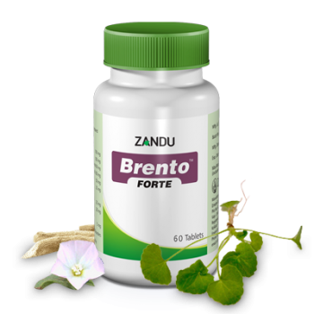

# Brento Forte

[TOC]

Zandu introduces extract based Forte Range of products in attractive HDPE container; herbs in extract form (100% soluble fraction) ensures better bioavailability; confirms the superiority & potency of Forte formulation with just 1 tab BD dosage. Its indication are as follows: Generral mental debility, Mental retardation, Senile dementia, Age related memory impairment. As a daily supplement, Brento Forte has been found to offer immense benefit for students, working people, professionals & elderly people with associated memory weakness.

## Composition
[Aparajita](Aparajita.md) Shankhpushpi (Convolvulus microphyllus) extract-140 mg, [Brahmi](Brahmi.md) (Bacopa monnieri) extract-140 mg, Mandukparni (Centella asiatica) extract-100, [Ashwagandha](Ashwagandha.md) (Withania somnifera) extract-25 mg, Jyotishmati (Celastrus paniculata) extract-20 mg.

## Dosage
1 tablet twice daily or as directed by the physician.

* Extract based formula ensures better efficacy, potency & better disease control.
Better patient compliance with just 1 tab BD dosage compare to 2 tablet BD or TID conventional dosage.
Derived from natural source, no side effects or adverse effects reported.
