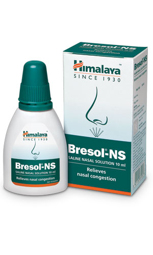

# Bresol - NS

[TOC]

## Action
A saline nasal solution infused with the power of herbs, Bresol-NS helps relieve nasal congestion due to allergies and upper respiratory tract infections. Bresol-NS moistens the nasal mucosa, clears the nasal mucus, softens the mucous crusts, and helps wash off allergens. The antimicrobial, anti-inflammatory, and anti-allergic actions help soothe the irritated and swollen mucosa by targeting inflammation and strengthens natural defenses.

## Indications
* Nasal congestion due to:
* Allergy
* Common cold
* Upper respiratory tract infections
* Nasal polyp
* Deviated nasal septum
* Dry, irritated, and stuffy nasal passages

## Key ingredients
Ayurveda texts and modern research back the following facts:

* [Yashtimadhu](Yashtimadhu.md) ([Glycyrrhiza glabra](Glycyrrhiza_glabra.md)) has anti-inflammatory, mast cell-stabilizing, and demulcent properties.
* [Parnayavani](Parnayavani.md) ([Coleus aromaticus](Coleus_aromaticus.md)) possesses anti-inflammatory and mast cell-stabilizing properties.
* [Tailaparna](Tailaparna.md) ([Eucalyptus globulus](Eucalyptus_globulus.md)) has antimicrobial properties and improves ciliary movement and airflow.

## Directions for use
* Squirt 2-3 drops/sprays in each nostril 3-4 times daily. For drops, squeeze the bottle in an upside-down position. For spray, squeeze the bottle in an upright position.

## Side effects
* Bresol-NS is not known to have any side effects if used as per the prescribed dosage.

## References

## References

1. Products of the Himalaya Drug Company
