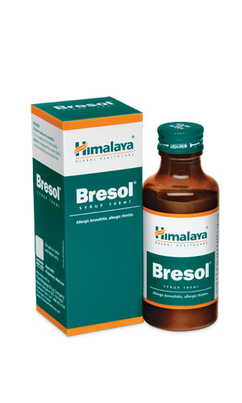

# Bresol syrup

[TOC]

## Action
Combats respiratory disorders:  The natural ingredients in Bresol synergistically act to provide symptomatic relief in allergic respiratory conditions. Its antihistaminic property manages symptoms associated with respiratory disorders. The mucolytic (reducing the viscosity of mucus) and bronchodilatory (decreasing resistance in the breathing airways) properties of Bresol are helpful in liquefying and relieving nasal and bronchial congestion. Its antimicrobial action combats infections caused by gram-positive and gram-negative bacteria.

## Indications
* Allergic rhinitis (stuffy nose)
* Allergic bronchitis
* Bronchial asthma
* Pollen allergy

## Key ingredients
Ayurveda texts and modern research back the following facts:

Turmeric ([Haridra](Haridra.md)) contains curcumin, a chemical constituent which blocks NF-kappa B, a protein complex that is linked to allergy and asthma.

Holy Basil ([Tulasi](Tulasi.md)) possesses potent antihistaminic properties, which protect against pollen-induced bronchospasms. Holy Basil inhibits the production of nitric oxide, which renders the herb its antioxidant property. This is helpful in treating allergic respiratory disorders.

[Malabar Nut](Malabar_Nut.md) ([Vasaka](Vasaka.md)) is widely used as a mucolytic, which thins mucus sputum and alleviates cough. Alkaloids found in the herb enhance its bronchodilatory property. This function improves breathing in respiratory disorders.

## Directions for use
* Please consult your physician to prescribe the dosage that best suits the condition.

## Side effects
* Bresol is not known to have any side effects if taken as per the prescribed dosage.

## References

## References

1. Products of the Himalaya Drug Company
