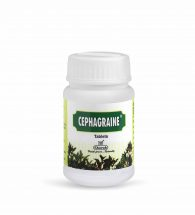

# Cephagraine

*In sinusitis*, **CEPHAGRAINE** reduces inflammation, liquefies mucus and relieves congestion. CEPHAGRAINE reduces frequency, severity and duration of migraine by antiinflammatory and analgesic property. CEPHAGRAINE also relieves migraine-associated sensory aura such as headache, nausea, vomiting and tinnitus. CEPHAGRAINE constricts the dilated blood vessels in the nose, head, and brain, to reduce the migraine attack. [Pipli](Pipli.md) (Piper longum), Ark phool (Calotropis gigantea).
