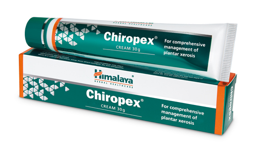

# Chiropex cream

[TOC]

## Action
* Moisturizing action: The essential fatty acids in Chiropex act as emollients, which soften skin and help skin retain moisture, relieving dryness and itching due to plantar xerosis.

* Analgesic and anti-inflammatory actions: Chiropex relieves the pain and inflammation associated with fissure feet.

* Antimicrobial and wound-healing actions: Chiropex prevents secondary bacterial infections of fissure feet and promotes wound-healing.
Chiropex is non-greasy and non-staining.

* Chiropex is safe and suitable to use in patients of all age groups.

## Indications
* Plantar xerosis.

## Key ingredients
* Ayurveda texts and modern research back the following facts:

* Flaxseed (Linum usitatissimum) oil is rich in polyunsaturated fatty acids (PUFAs), which act as emollients, fill up the spaces between skin, helping to maintain skin hydration and integrity. The a-linolenic acid (an omega-3 fatty acid) in the oil has potent anti-inflammatory action and promotes skin repair.

* Pongam Tree ([Pongamia pinnata](Pongamia_pinnata.md)) oil is very useful in promoting wound-healing. It is traditionally used to treat itchy skin, abscesses, and other skin ailments. The oil from the seed of Pongamia pinnata exhibits a high degree of antifungal and antibacterial activity. Its emollient property softens and soothes the skin.

* Basil ([Ocimum basilicum](Ocimum_basilicum.md)) oil and Peppermint satva ([Menthol](Menthol.md)) also play an important role in reducing the pain and inflammation associated with fissure feet.

* Lemon ([Citrus limon](Citrus_limon.md)) oil reduces the pain in fissure feet, and has powerful anti-inflammatory and antimicrobial properties.

* Honey acts as a moisturizing agent that helps the skin to absorb and retain moisture from the atmosphere. Honey is capable of inhibiting the major wound-infecting species of bacteria. It provides a protective barrier to prevent cross-infection, and thus helps accelerate wound-healing.

## Directions for use
* After washing and drying feet, Chiropex cream should be applied on the affected areas in a circular motion. Recommended twice daily for best results.

## Side effects
## References

## References

1. Products of the Himalaya Drug Company
