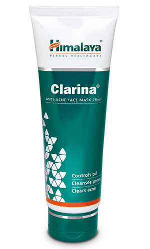

# Clarina Anti-Acne Face Mask

[TOC]

## Action
Effective cleanser: Clarina Anti-Acne Face Mask prevents clogged pores with its deep cleansing action. It contains a natural form of salicylic acid, which has keratolytic (a peeling agent) and comedolytic (opens clogged pores) actions.

## Indications
* Acne vulgaris.

## Key ingredients
* Ayurveda texts and modern research back the following facts:

* Turmeric (Haridra) has strong anti-inflammatory properties, which soothe the skin gently. The herb helps to even out skin tone and color, making it an excellent ingredient in a face wash. Turmeric also helps to retain the skin’s elasticity and makes it more supple.

* Barbados Aloe (Ghrita-kumari) is revered in Ayurveda for its wound healing properties. It is also beneficial in treating insect bites and allergies. When applied topically, the antiseptic, astringent and antifungal activity of the herb relieves skin itching and dryness.

* Indian Willow (Jalavetasa) clears debris from the skin’s surface and unclogs pores with its deep-cleansing action.

## Directions for use
* Cleanse face and neck. Apply Clarina Anti-Acne Face Mask evenly all over face and neck, avoiding area around eyes. Let the mask dry for 10-15 minutes and remove with a wet sponge or towel. Rinse with cool water. For best results, use twice a week.

## Side effects
* Clarina Anti-Acne Face Mask is not known to have any side effects.

## References

## References

1. Products of the Himalaya Drug Company
