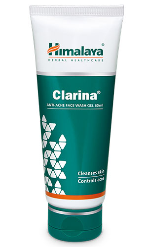

# Clarina Anti-Acne Face wash gel

[TOC]

## Action
Acne control: Clarina Anti-Acne Face Wash Gel has anti-inflammatory, keratolytic (a peeling agent), antioxidant and antibacterial properties, which work synergistically to control acne. It eliminates propionibacterium acnes, the acne bacterium, and prevents excess sebum production, one of the main causes of acne.

## Indications
* Acne vulgaris.

## Key ingredients
* Ayurveda texts and modern research back the following facts:

* Barbados Aloe ([Ghrita-kumari](Ghrita-kumari.md)) has potent antibacterial, antiseptic and antifungal properties, which are beneficial in treating skin wounds, allergies and insect bites. Aloe has soothing properties which relieve dryness and itching.

* Neem ([Nimba](Nimba.md)) is especially beneficial for skin disorders like eczema and minor skin infections. Neem leaves also eliminate acne-causing bacteria.

* Turmeric ([Haridra](Haridra.md)) has strong anti-inflammatory properties, which soothe the skin gently. The herb helps to even out skin tone and color, making it an excellent ingredient in a face wash. Turmeric also helps to retain the skin’s elasticity and makes it more supple.

## Directions for use
* Moisten face. Take a small quantity of Clarina Anti-Acne Face Wash Gel and apply using a gentle circular motion, working up a lather. Rinse well and pat dry.

## Side effects
* Clarina Anti-Acne Face Wash Gel is not known to have any side effects.

## References

## References

1. Products of the Himalaya Drug Company
