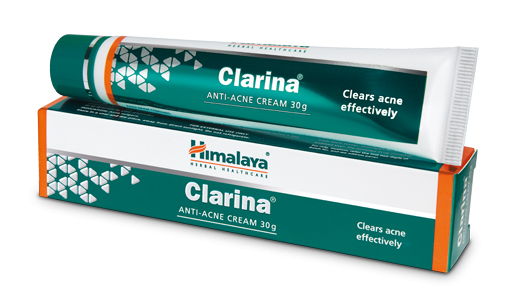

# Clarina Anti-Acne cream

[TOC]

## Action
Acne control: Clarina Anti-Acne Cream has antimicrobial, anti-inflammatory, wound-healing, antioxidant, astringent, emollient and soothing properties, which act synergistically in the management of acne. The cream also relieves the burning and itching associated with acne.

## Indications
* Acne vulgaris.
* Acne rosacea.

## Key ingredients
* Ayurveda texts and modern research back the following facts:

* Barbados Aloe ([Ghrita-kumari](Ghrita-kumari.md)) has potent antibacterial, antiseptic and antifungal properties, which are beneficial in treating skin wounds, allergies and insect bites. Aloe also has soothing properties which relieve dryness and itching.

* Almond ([Vatada](Vatada.md)) smoothes and rejuvenates the skin and is effective in improving skin complexion and tone.

* Indian Madder ([Manjishtha](Manjishtha.md)) is an effective blood purifier that clears up skin conditions from the inside out. It helps rectify uneven skin pigmentation and treats eczema, acne, scabies and skin allergies.

## Directions for use
* After cleansing face and neck, apply Clarina Anti-Acne Cream on acne lesions and inflamed areas, twice daily, until the lesions have completely healed.

## Side effects
* Clarina Anti-Acne Cream is not known to have any side effects.

## References

## References

1. Products of the Himalaya Drug Company
