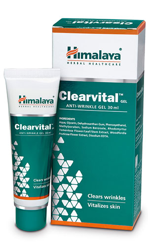

# Clearvital

**Clearvital** reduces the appearance of fine lines, age spots and wrinkles on facial skin. It protects collagen and elastin, the fibers that determine the mechanical properties and structure of the skin. Clearvital also speeds up the process of collagen synthesis.

**Premature aging**: The antioxidant property of the gel protects the skin from oxidative damage such as photodamage, which is a leading cause of wrinkles.

## Key ingredients
**[Rose](Rose.md) Myrtle** (Rhodomyrtus tomentosa) has effective elastase-inhibitory properties, which are beneficial in retaining skin elasticity and firmness.

**Fire-Flame Bush** (Dhataki) is an antioxidant that protects collagen fiber, which helps in slowing down the skin’s aging process.
