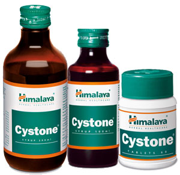

# Cystone

**Cystone** has potent anti-lithiatic (prevents the formation of kidney stones) and lithotriptic (dissolves kidney stones) properties. It prevents the accumulation, deposition and supersaturation of calculogenic chemicals like oxalic acid and calcium hydroxyproline in urine. This action inhibits the formation of kidney stones. Its lithotriptic property dissolves mucin, which binds the stone particles together. Cystone is also a diuretic that flushes out small stones from the kidneys.

**Combats urinary tract infections and symptoms**: Cystone normalizes urinary pH and alleviates burning during urination. Its antimicrobial property combats common urinary pathogens. Its demulcent and anti-inflammatory properties are beneficial in soothing an irritated bladder.

## Key ingredients
**Small Caltrops** (Gokshura) is helpful the management of uro-genital diseases like kidney stones, bladder infection and other urinary tract infections. It helps promote general urinary tract health by eliminating dysuria (painful urination or blood present in urine) and crystalluria. Small Caltrops prevents the deposition, accumulation and supersaturation of calculogenic chemicals in urine. It is a potent antimicrobial agent.

**Pasanabheda** (Saxifraga Ligulata) possesses diuretic, demulcent and antimicrobial properties. Due to a high content of mucilage, which renders the herb its demulcent property, Pasanabheda soothes and protects irritated or inflamed internal tissue. As a diuretic, the herb helps to flush out small stones and gravel along with urine.

**Shilapushpa**(Didymocarpus pedicellata) is known for its antilithiatic property, which prevents the formation of urinary stones. As a lithotriptic, Shilapushpa helps dissolve kidney stones. The herb is also known for its antimicrobial properties.
