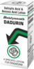

# Dadurin lotion

[TOC]

## Importance
Effective liquid works as Antifungal and Antibacterial useful in skin infections, Eczema, Ringworm, Psoriasis and other skin diseases.

## Dosage
Wash infected part of body by warm water and then apply dadurin on infected part gently.

## Indications
1. Heals ringworm
1. Effective in Skin diseases
1. Anti-fungal
1. Anti-bacterial

## References
* [Baidyanath](http://www.baidyanath.org/product.php)
