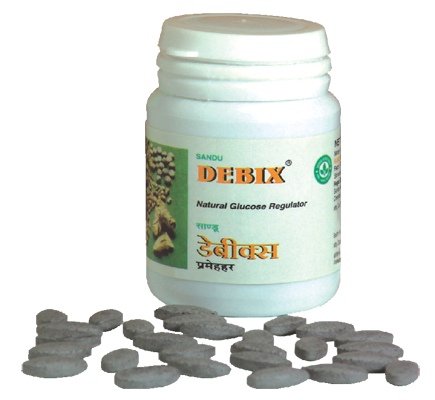

# Debix

[TOC]

**Natural Glucose Regulator**

It stimulates Beta-cells of Lagarhans for the insulin secretion. It inhibits absorption of carbohydrates from intestine into the blood. It corrects polyuria by its astringent action. It helps in regeneration of cells of pancreas by virtue of herbs like Gymnema sylvestre. It corrects lipid metabolism and helps in preventing atherosclerosis which in turn prevents IHD, nephropathy and angiopathy. It also acts as nervine tonic, thus useful in neuropathy. It is particularly very effective in newly diagnosed mild to moderate cases of NIDDM.

Debix can also be used supportively in IDDM cases where insulin dose can be continuously titrated.

## Indications
Diabetes, polyurea, diabetic neuropathy, diabetic erectile dysfunction, diabetic retinopathy

## Dose
1-2 tablet 3 times

## Ingredients
Gymnema sylvestar, [Malabar plum](Malabar_plum.md) (Syzygium cumini), Salacia chinenis , [Terminalia arjuna](Terminalia_arjuna.md), [Guduchi](Guduchi.md) (Tinospora cordifolia), Momordica charantia Caesalpinia crista, [Haridra](Haridra.md) (Curcuma longa), Shuddha Shilajit, Vanga Bhasma, Jasad Bhasma, Abhrak bhasma, Loha Bhasma, Purified Strychnous nuxvomica.
