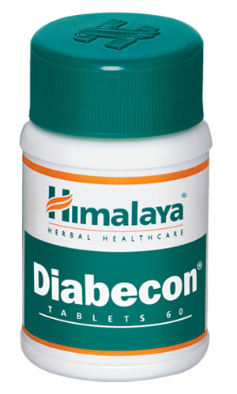

# Diabecon

The natural ingredients in **Diabecon** increase insulin secretion in the body. By reducing the glycated hemoglobin level (form of hemoglobin used to measure glucose content in the blood) level, normalizing microalbuminuria (a condition which is an important prognostic marker for kidney disease in diabetes mellitus) and modulating the lipid profile, Diabecon minimizes long-term diabetic complications. The drug also increases hepatic and muscle glycogen content, which enhances the peripheral utilization of glucose.

**Anti-hyperglycemic**: Diabecon reduces high glucose content in the blood. Effective hyperglycemic control is important in preventing micro- and macrovascular complications (large and small blood vessels) arising from diabetes.
