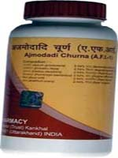

# Divya Ajmodadi Churna (Powder)

**Divya Ajmodadi Churna** is a combination of natural herbs that is recommended for arthritis. It is one of the best arthritis remedy that give quick comfort from rigidity of the joints. It is a natural remedy for arthritis relief that quickly reduces rigidity and inflammation of the joints. It is an amazing substitute treatment for knee pain relief that improves activity of the muscles and bones and reduces discomfort and inflammation. All the herbs present in this substitute treatment are safe and do not generate any complication. These organic herbs offer nutrition to the joints and assist in regular performing and activity of the joints. There are different types of arthritis and it is a suitable remedy for all types of arthritis.

## Benefits of Divya Ajmodadi Churna
1. Divya Ajmodadi Churna is useful for discomfort in the joints and muscle tissue. It is one of the best osteoarthritis organic remedy that provides nutritional value to the joints and promote their effective functioning.
1. Divya Ajmodadi Churna is beneficial for old people who face difficulty in walking due to weakness of the joints.
1. Divya Ajmodadi Churna is an amazing item for women who suffer from joint pain due to brittle bones after menopause.
1. Divya Ajmodadi Churna provides strength to the bone and muscle tissue and makes them strong for easy movement.
1. Divya Ajmodadi Churna is a natural Powder for arthritis and provides nutritional value to the joints so that they may function normally
