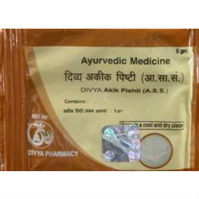

# Divya Akik Pishti

Divya akik pishti is a natural product which is prepared from a natural mineral stone named as akika. Akika is widely used for the preparation of natural remedies for the treatment of various diseases. Akika is found to be effective for preventing heart diseases, digestive disorders and liver disorders. This natural mineral stone helps to provide energy and natural minerals to the body for strengthening of nerves. Akika is found in different colors white, blue, red and yellowish. White color is widely used for the preparation of remedies. Divya akik pishti is a natural remedy prepared by baba ramdev pharmacy that helps in the prevention of gastric diseases, heart diseases, nervous disorders, etc. Divya akik pishti provide natural minerals to the body and rejuvenates the cells for effective functioning. This natural mineral stone is found to possess healing and soothing properties.

## Advantages
Divya akik pishti is a natural product and helps in the treatment of various disorders naturally. The most important advantage of Divya akik pishti is that it helps in healing of the various disorders naturally. This natural substance provides natural minerals to the nerves and other parts of the body for optimum functioning of all parts of the body. Divya akik pishti provide energy to body cells for natural healing. The natural minerals present in Divya akik pishti nourish the nerves and cells of the body naturally for optimum functioning. Divya akik pishti is a natural product and may be taken regularly for increasing body strength and to get rid of weakness and tiredness. It is a natural rejuvenating substance that provides energy to all parts of the body.
