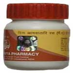

# Divya Amavatari Ras

Divya Amavatari ras is a blend of natural herbs that are safe and natural and helps in joint pain relief. This natural treatment for arthritis helps in quickly giving relief from swelling and stiffness of the joints. It is a wonderful remedy for arthritis and gout. Divya amavatari ras is a joint pain natural cure and it gives permanent relief from swelling and tenderness in the joint. This herbal remedy provides strength to the bones and support in normal functioning of the joints. It increases the strength by providing natural nourishment to the joints and promotes easy movement of the joints.

## Benefits of Divya Amavatari Ras
1. Divya Amavatari Ras is a wonderful joint pain natural cure that provided relief from pain and swelling of the joints.
1. Divya Amavatari Ras is beneficial in the treatment of arthritis and gout and is free from side effects.
1. Divya Amavatari Ras gives immediate joint pain relief by providing strength to the joints.
1. Divya Amavatari Ras increases oxygenation of the bones and joints and helps in normal functioning of the joints.
1. Divya Amavatari Ras is a well known natural remedy for the treatment of diseases of bones and joints and it is absolutely natural and safe and do not produce any side effects.
1. Divya Amavatari Ras may be taken for a long time regularly for natural arthritis treatment.
